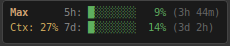

# xfce4-claude-status-plugin

Native XFCE panel plugin showing Claude Max/Pro rate limit usage.



## Features

- **5-hour rate limit** - Progress bar with time until reset
- **7-day rate limit** - Progress bar with time until reset
- **Context window usage** - Percentage from current Claude Code session
- **Terminal-style appearance** - Dark background, monospace font, colored progress bars
- Color-coded indicators (green → yellow → orange → red)

## Requirements

- XFCE desktop environment
- Claude Max or Pro subscription
- Claude Code installed and logged in (uses its OAuth credentials from `~/.claude/.credentials.json`)

## Installation from apt repository

```bash
# Add the repository (choose your Debian version)

# For Debian stable (Bookworm):
echo "deb [trusted=yes] https://jcurbo.github.io/xfce4-claude-status-plugin stable main" | sudo tee /etc/apt/sources.list.d/claude-status.list

# For Debian testing (Trixie):
echo "deb [trusted=yes] https://jcurbo.github.io/xfce4-claude-status-plugin testing main" | sudo tee /etc/apt/sources.list.d/claude-status.list

# For Debian unstable (Sid):
echo "deb [trusted=yes] https://jcurbo.github.io/xfce4-claude-status-plugin unstable main" | sudo tee /etc/apt/sources.list.d/claude-status.list

# Update and install
sudo apt update
sudo apt install xfce4-claude-status-plugin
```

You can also use codenames directly: `bookworm`, `trixie`, `sid`

Then right-click the panel → Add New Items → Claude Status

## Building from source

### Dependencies (Debian)

```bash
sudo apt install build-essential pkg-config debhelper \
    libxfce4panel-2.0-dev libxfce4ui-2-dev libgtk-3-dev \
    libjson-glib-dev libsoup-3.0-dev
```

### Build Debian package

```bash
dpkg-buildpackage -us -uc -b
sudo dpkg -i ../xfce4-claude-status-plugin_*.deb
```

### Refresh panel

```bash
xfce4-panel -r
```

Then right-click the panel → Add New Items → Claude Status

## Tested on

- Debian Bookworm (stable)
- Debian Trixie/Sid (testing/unstable)

May work on Ubuntu and other Debian-based distributions with XFCE, but untested.

## How it works

1. Reads OAuth credentials from `~/.claude/.credentials.json` (created by Claude Code)
2. Fetches rate limit data from Anthropic's OAuth API (`api.anthropic.com/api/oauth/usage`)
3. Reads context window usage from Claude Code transcript files (`~/.claude/projects/`)
4. Updates every 30 seconds

## License

MIT
